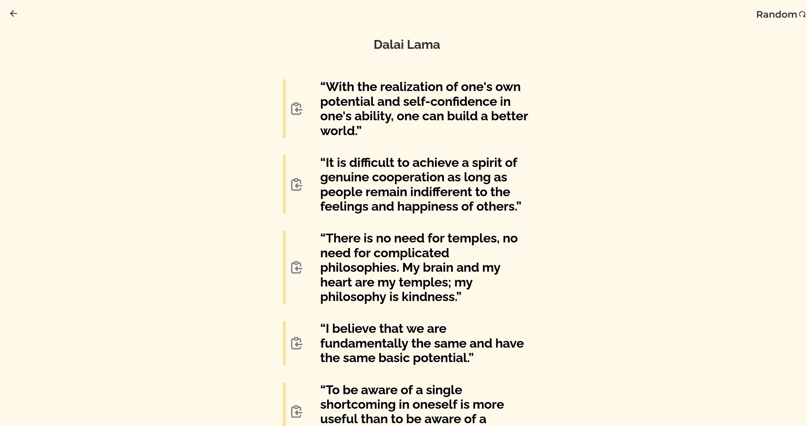
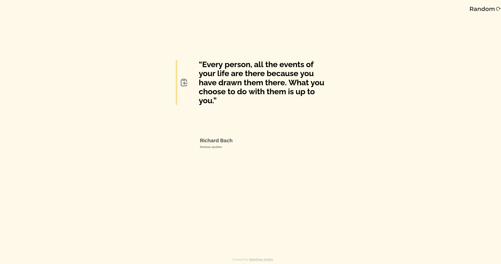
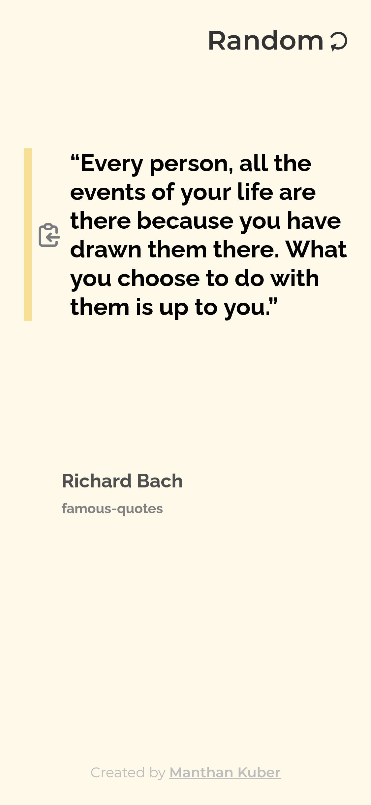
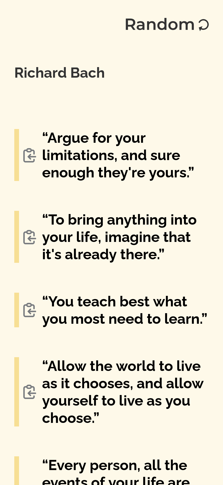

<h1 align="center">Quote Generator</h1>

A Quote Generator app that generates quotes randomly and also allows you to see quotes of a specific quote author.You can alos copy the quote to your clipboard by clicking on the provided button 

  <h3>
    <a href="https://quote-generator-manthan-kuber.vercel.app/">
      Live Demo
    </a>
  </h3>

<!-- TABLE OF CONTENTS -->

## Table of Contents

- [Overview](#overview)
- [Learnings](#learnings)
- [Contact](#contact)

<!-- OVERVIEW -->

## Overview

Desktop Screenshot

Mobile Screenshot

### Built With

<!-- This section should list any major frameworks that you built your project using. Here are a few examples.-->

- [React](https://reactjs.org/)
- [StyledComponents](https://styled-components.com/)
- [FramerMotion](https://www.framer.com/motion/)

## Learnings

- Improved Typescript Fundamentals
- Improved Animations and styles
- Improved async Js
- Improved making API calls properly 

## Contact

- GitHub [@Manthan-Kuber](https://github.com/Manthan-Kuber)
